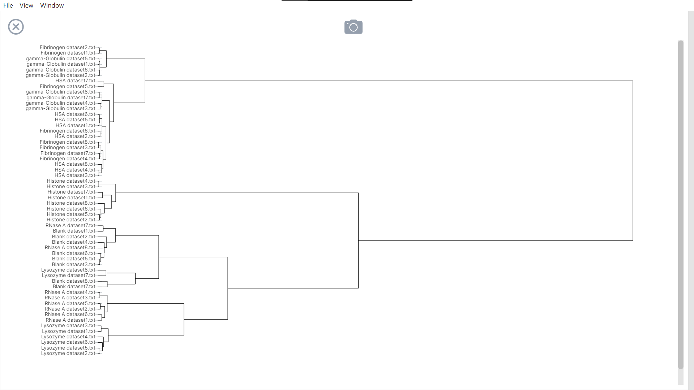

[![Contributors][contributors-shield]][contributors-url]
[![Forks][forks-shield]][forks-url]
[![Stargazers][stars-shield]][stars-url]
[![Issues][issues-shield]][issues-url]
[![GPL License][license-shield]][license-url]


<h1 align="center">Open PCA and HCA</h1>
<p align="center">
  <!-- PROJECT LOGO -->
  
  <p align="center">
    Desktop application to apply and visualize data analysis algorithms (specifically principal component and hierarchical clustering) 
    <br />
    <a href="https://github.com/shadowstriker15/open-pca-hca"><strong>Explore the docs »</strong></a>
    <br />
    <br />
    <a href="https://github.com/shadowstriker15/open-pca-hca">View Demo</a>
    ·
    <a href="https://github.com/shadowstriker15/open-pca-hca/issues">Report Bug</a>
    ·
    <a href="https://github.com/shadowstriker15/open-pca-hca/issues">Request Feature</a>
  </p>
</p>


<!-- TABLE OF CONTENTS -->
<details open="open">
  <summary><h2 style="display: inline-block">Table of Contents</h2></summary>
  <ol>
    <li>
      <a href="#about-the-project">About The Project</a>
      <ul>
        <li><a href="#what-is-open-pca-and-hca">What is Open PCA and HCA?</a></li>
        <li><a href="#built-with">Built With</a></li>
      </ul>
    </li>
    <li>
      <a href="#getting-started">Getting Started</a>
      <ul>
        <li><a href="#prerequisites">Prerequisites</a></li>
        <li><a href="#installation">Installation</a></li>
      </ul>
    </li>
    <li><a href="#packaging">Packaging</a></li>
    <li><a href="#releases">Releases</a></li>
    <li><a href="#user-guide">User Guide</a></li>
    <li><a href="#features">Features</a></li>
    <li><a href="#contributors">Contributors</a></li>
    <li><a href="#roadmap">Roadmap</a></li>
    <li><a href="#contributing">Contributing</a></li>
    <li><a href="#license">License</a></li>
    <li><a href="#acknowledgements">Acknowledgements</a></li>
  </ol>
</details>


<!-- ABOUT THE PROJECT -->
## About The Project

Open PCA and HCA (Open) is the redevelopement of a semester-long capstone group project called [RPIDS](https://github.com/CSC450-Project-1/rpids), which was created in CSC450 Introduction to Software Engineering - Spring 2021. RPIDS set out to be used to assist Missouri State University (MSU) chemistry students with analysis of multidimensional data collected from chemical sensor arrays. Open was created with the project's longevity in mind by making it easy for future contributors to continue development on the application. 

### What is Open PCA and HCA?
Open PCA and HCA is a student-developed software that streamlines the process of data analysis for multidimensional data.

Open is a GUI-based software that uses two statistical methods: principal component analysis (PCA) and hierarchical clustering analysis (HCA). Open pre-processes input data, performs the statistical analysis, and displays plots of the processed data.

The two available PCA plots are 2D and 3D views. The available HCA plots are the distance dendrogram and two heatmaps - samples over dimensions heatmap and distance heatmap.

### Built With

* [Electron](https://www.electronjs.org)
* [Vuetify](https://vuetifyjs.com)
* [Plotly js](https://plotly.com/javascript)
* [ml.js](https://github.com/mljs)
* [D3.js](https://d3js.org/)
* [dataframe-js](https://github.com/Gmousse/dataframe-js)


<!-- GETTING STARTED -->
## Getting Started

To get a local copy up and running follow these simple steps.

### Prerequisites

To get Open to compile, you will need the necessary Node dependencies installed. Before attempting to install these, please make sure you have the latest Node.js (v14.17.3 or later) installed on your local machine.

Once you have ensured that you have Node.js installed, please navigate to the project's home directory (open-pca-hca). Please run the following command to install the necessary dependencies.

  ```sh
  npm i
  ```
To start the program, please run the following command
  ```sh
  npm run electron:serve
  ```

## Packaging

To create a Window's executable, simply run the following command
   ```sh
   npm run electron:build --fix
   ```
If successful, a new executable will be created in the `dist_electron` directory named `open-pca-hca Setup {version number}.exe`.
## Releases
* [v1.0.0](TODO)

## User Guide
<ol>
  <li>Download the latest <a href="#releases">release</a></li>
  <li>Run the executable and go through the first-time installation setup process</li>
  <li>You will be greeted with the following page. Here you will be able to manage your previously created sessions
  
  </li>
  <li>Clicking the "New session" button, you will begin the import process for a new session. During this step, you will name the session and select the import process based on how your data is saved. The "Single" format is intended to be used to import the dataframe file exported by an Open session.
  
  </li>
  <li>The "Separated" format is when your data is separated into a label file and data file(s). During the "Separated" import process, you will be asked how your data is formatted (row or column). If necessary, please refer to the included samples for valid datasets
  
  </li>
  <li>Once the data has been imported, you will be greeted with the home page where you can switch between the different available graphs</li>
</ol>

## Features

<ul>
 <li>
 <h3>PCA 2D Plot</h3>
 
 </li>
 <li>
 <h3>PCA 3D Plot</h3>
 
 </li>
 <li>
 <h3>HCA Dendrogram</h3>
 
 </li>
 <li>
 <h3>HCA Heatmap - Samples / Dimensions</h3>
 
 </li>
 <li>
 <h3>HCA Heatmap - Distance (Euclidean)</h3>
 
 </li>
 <li>
 <h3>Graph Settings</h3>
 With all of Open's graphs, there are available settings to customize the graph to your liking. These settings include changing how the data is scaled and how the graph looks
  <ul>
    <li>Dimention Scaling</li>
    The available scaling options are
    <ul>
      <li>Centering</li>
      <li>Linear Scaling (min-max)</li>
      <li>Standardizing (z-score)</li>
    </ul>
    <li>Clustering</li>
    The HCA graphs that include a dendrogram have the following clustering methods available
    <ul>
      <li>Ward's</li>
      <li>Complete</li>
      <li>Single</li>
      <li>UPGMA (unweighted pair group method with arithmetic mean)</li>
      <li>WPGMA (weighted pair group method with arithmetic mean)</li>
      <li>UPGMC (unweighted centroid clustering)</li>
    </ul>
  </ul>
   
 </li>
 <li>
 <h3>Screenshot</h3>
 All the graphs can be saved as a SVG image using the screenshot ability
 </li>
 <li>
 <h3>Export Data</h3>
  A session's data can be exported while being accessed. The following data will be exported
  <ul>
    <li>Generated dataframe</li>
    <li>PCA files
      <ul>
        <li>
        PC values
        </li>
        <li>
        Eigen values
        </li>
        <li>
        Eigen vectors
        </li>
        <li>
        Explained variance
        </li>
      </ul>
    </li>
    <li>HCA files
      <ul>
        <li>
        Distance matrix
        </li>
      </ul>
    </li>
  </ul>
 </li>
 <li>
  <h3>Dark Mode</h3>
  A dark mode theme has been created, which can be toggled on or off at any time
 </li>
</ul>

<!-- TROUBLE SHOOTING NOTES -->
## Trouble shooting notes

* If importing of Excel files does not work, save the files in CSV format (CSV (Comma Delimited) (*.csv)) and try again.


<!-- CONTRIBUTORS -->
## Contributors

* Austin Pearce


<!-- ROADMAP -->
## Roadmap

See the [open issues](https://github.com/shadowstriker15/open-pca-hca/issues) for a list of proposed features (and known issues).

<!-- CONTRIBUTING -->
## Contributing

Contributions are what make the open source community such an amazing place to be learn, inspire, and create. Any contributions you make are **greatly appreciated**.

1. Fork the Project
2. Create your Feature Branch (`git checkout -b feature/AmazingFeature`)
3. Commit your Changes (`git commit -m 'Add some AmazingFeature'`)
4. Push to the Branch (`git push origin feature/AmazingFeature`)
5. Open a Pull Request


<!-- LICENSE -->
## License

Distributed under the GPL License. See `LICENSE` for more information.


<!-- ACKNOWLEDGEMENTS -->
## Acknowledgements

* Dr. Razib Iqbal (MSU Computer Science Associate Professor)
* Dr. Keiichi Yoshimatsu (MSU Chemistry Associate Professor)


<!-- MARKDOWN LINKS & IMAGES -->
<!-- https://www.markdownguide.org/basic-syntax/#reference-style-links -->
[contributors-shield]: https://img.shields.io/github/contributors/shadowstriker15/open-pca-hca.svg?style=for-the-badge
[contributors-url]: https://github.com/shadowstriker15/open-pca-hca/graphs/contributors
[forks-shield]: https://img.shields.io/github/forks/shadowstriker15/open-pca-hca.svg?style=for-the-badge
[forks-url]: https://github.com/shadowstriker15/open-pca-hca/network/members
[stars-shield]: https://img.shields.io/github/stars/shadowstriker15/open-pca-hca.svg?style=for-the-badge
[stars-url]: https://github.com/CSC450-Project-1/repo/stargazers
[issues-shield]: https://img.shields.io/github/issues/shadowstriker15/open-pca-hca.svg?style=for-the-badge
[issues-url]: https://github.com/shadowstriker15/open-pca-hca/issues
[license-shield]: https://img.shields.io/github/license/shadowstriker15/open-pca-hca.svg?style=for-the-badge
[license-url]: https://github.com/shadowstriker15/open-pca-hca/blob/main/docs/LICENSE.md
